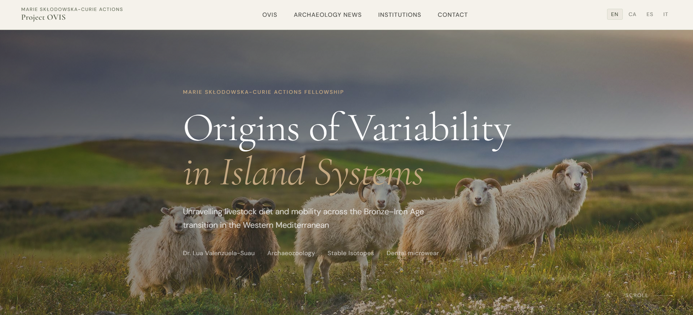

# 🏛️ OVIS Project — Website

Static website for the **OVIS** research project (*Origins of Variability in Island Systems*), a Marie Skłodowska-Curie Actions fellowship led by Dr. Lua Valenzuela at Cardiff University.

🔗 http://www.ovisproject.com



## About this project

A website built with HTML, CSS and JavaScript for an academic research project. The stack was kept intentionally simple — no frameworks, no build tools — to keep it easy to maintain long-term.

I used [Claude](https://claude.ai) (Anthropic) as an assistant to speed up parts of the frontend implementation.

## Stack

- Pure **HTML5 + CSS3 + Vanilla JS** — no frameworks, no build tools
- Google Fonts — Cormorant Garamond + DM Sans
- Images — [Unsplash](https://unsplash.com/license) (free license, no attribution required)

## Hosting & Deployment

- Source code hosted on **GitHub**
- Deployed via **Netlify** (connected to this repo — pushes to `main` trigger automatic deploys)
- Custom domain managed through **Namecheap**, with DNS pointing to Netlify

## Features

- Fully responsive (mobile, tablet, desktop)
- **4-language support** — English, Catalan, Spanish, Italian (client-side i18n, no dependencies)
- Interactive map (Leaflet + live OpenStreetMap data) showing the Menorca, Mallorca and Sardinia field sites
- Sections: News, Project, Institutions, Bibliography (with category filters), Discussion, Contact
- Minimalist academic design — olive green & cream palette

## 📁 Project structure

```
├── index.html         # Home page — hero, news, map
├── ovis.html          # About the project, bibliography, discussion
├── arqueo.html        # Archaeology news
├── institutions.html  # Funder, host institution and partners
├── contact.html       # Contact form and team details
├── style.css          # All styles (CSS variables, responsive)
├── script.js          # i18n translations + UI interactions
├── CNAME              # Custom domain config for Netlify
└── img/               # Hero images, logos and social preview
```

---

*Research project funded by the European Union — Horizon Europe, Marie Skłodowska-Curie Actions.*
